<div align="center">

</div>

<div align="center">

</div>


## ✦ Constellation Registry — Skills & Weapons

> *Every constellation grants power to those worthy of their sponsorship.*

<div align="center">



</div>

---

## ✦ Scenario Archive — Featured Projects

> *Each scenario tests a different kind of strength. These are the ones I survived.*

<table>
<tr>
<td width="50%">

### 📖 [Project Alpha](https://github.com/A-S-Ayon/my_second)
**[ Scenario Type: practice ]**

> *"Getting used to a forseen relam"*
Just practicing and exploring

`Python`

⭐ `XX stars` · 🍴 `XX forks`

</td>


<td width="50%">


</tr>
</table>

---

## ✦ Dokkaebi's Report — GitHub Stats

> *[SYSTEM: Accessing the Akashic Records... Current record holder data retrieved.]*

<div align="center">


</div>

<div align="center">


</div>

---

## ✦ The 1863 Turns — Activity & Contributions

<div align="center">

[](https://github.com/ashutosh00710/github-readme-activity-graph)

</div>

---

## ✦ Companion Constellations — Connect

> *"The strongest scenarios are never survived alone."*

<div align="center">

[](https://linkedin.com/in/yourusername)
[](https://yourportfolio.dev)
[](mailto:you@email.com)
[](https://twitter.com/yourusername)

</div>

---

## ✦ Current Scenario

```
[ ONGOING SCENARIO ]  ──────────────────────────────────────────

  ★  Learning  :  [ Automation & Web Scraping ]
  ⚔  Building  :  [ Anime Chatbot ]
  🌌  Reading   :  [ Ai Research papers, Lord of the Mystries]
  🔮  Goal      :  [Explore, Create ]

  "This is not the end of the story. There are still episodes left to write."

─────────────────────────────────────────────────────────────────
```

---

<div align="center">


<!-- PROFILE VIEWS COUNTER -->


*"There are no unimportant stories. Only stories not yet read."*

</div>
